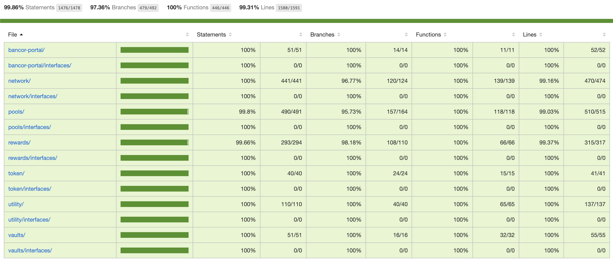

# Bancor Protocol Contracts v3.0 (Dawn Release)

[](https://github.com/bancorprotocol/contracts-v3/actions/workflows/ci.yml)

## Overview

Bancor is a decentralized trading and yield protocol. Its network of on-chain automated market makers (AMMs) supports instant token-to-token trades, as well as single-sided liquidity provision and auto-compounding staking rewards for any listed asset.

The Dawn release includes the following features:

-   Token to token trades
-   Single-sided Liquidity Provision
-   Omnipool
-   Infinity Pools
-   Auto-compounding Rewards
-   Dual Rewards
-   Third Party Liquidity Protection
-   Composable Pool Tokens
-   Tokenomics Redesign
-   Flash Loans

## Security

The repository is part of the bug bounty program.
See the details [here](./docs/bug-bounty.md).

The security policy is available [here](./SECURITY.md).

### Security Audits

-   [PeckShield](docs/audits/PeckShield-Audit-Report-BancorV3-v1.0.pdf)
-   [OpenZeppelin](docs/audits/OpenZeppelin-V3-Audit-Report.pdf)
-   [ChainSecurity](docs/audits/ChainSecurity-V3-Audit-Report.pdf)
-   [OpenZeppelin AutoCompoundingRewards](docs/audits/OpenZeppelin-AutoCompoundingRewards-Audit-Report.pdf)
-   Certora (coming soon...)
-   ChainSecurity (coming soon...)

## Setup

As a first step of contributing to the repo, you should install all the required dependencies via:

```sh
yarn install
```

You will also need to create and update the `.env` file if you’d like to interact or run the unit tests against mainnet forks (see [.env.example](./.env.example))

## Testing

Testing the protocol is possible via multiple approaches:

### Unit Tests

You can run the full test suite (takes about two hours) via:

```sh
yarn test
```

You can also run the test suite with additional stress tests via:

```sh
yarn test:nightly
```

This suite is called “nightly” since it’s scheduled to run every day at midnight against the release and production branches (see [nightly.yml](.github/workflows/nightly.yml)).

### Deployment Tests

You can test new deployments (and the health of the network) against a mainnet fork via:

```sh
yarn test:deploy
```

This will automatically be skipped on an already deployed and configured deployment scripts and will only test the additional changeset resulting by running any new/pending deployment scripts and perform an e2e test against the up to date state. This is especially useful to verify that any future deployments and upgrades, suggested by the DAO, work correctly and preserve the integrity of the system.

### Test Coverage

You can find historic test coverage reports in [releases](https://github.com/bancorprotocol/contracts-v3/releases).

#### Latest Test Coverage Report (2022-04-24)

-   99.86% Statements 1476/1478
-   97.36% Branches 479/492
-   100% Functions 446/446
-   99.31% Lines 1580/1591



```sh
-------------------------------------------|----------|----------|----------|----------|
File                                       |  % Stmts | % Branch |  % Funcs |  % Lines |
-------------------------------------------|----------|----------|----------|----------|
 bancor-portal/                            |      100 |      100 |      100 |      100 |
  BancorPortal.sol                         |      100 |      100 |      100 |      100 |
 bancor-portal/interfaces/                 |      100 |      100 |      100 |      100 |
  IBancorPortal.sol                        |      100 |      100 |      100 |      100 |
 network/                                  |      100 |    96.77 |      100 |    99.16 |
  BancorNetwork.sol                        |      100 |    96.97 |      100 |    99.16 |
  BancorNetworkInfo.sol                    |      100 |      100 |      100 |      100 |
  BancorV1Migration.sol                    |      100 |      100 |      100 |      100 |
  NetworkSettings.sol                      |      100 |      100 |      100 |      100 |
  PendingWithdrawals.sol                   |      100 |    88.89 |      100 |    96.67 |
 network/interfaces/                       |      100 |      100 |      100 |      100 |
  IBancorNetwork.sol                       |      100 |      100 |      100 |      100 |
  IBancorNetworkInfo.sol                   |      100 |      100 |      100 |      100 |
  INetworkSettings.sol                     |      100 |      100 |      100 |      100 |
  IPendingWithdrawals.sol                  |      100 |      100 |      100 |      100 |
 pools/                                    |     99.8 |    95.73 |      100 |    99.03 |
  BNTPool.sol                              |      100 |    94.44 |      100 |    98.98 |
  PoolCollection.sol                       |    99.67 |    95.97 |      100 |    99.05 |
  PoolCollectionWithdrawal.sol             |      100 |    92.86 |      100 |    98.15 |
  PoolMigrator.sol                         |      100 |      100 |      100 |      100 |
  PoolToken.sol                            |      100 |      100 |      100 |      100 |
  PoolTokenFactory.sol                     |      100 |      100 |      100 |      100 |
 pools/interfaces/                         |      100 |      100 |      100 |      100 |
  IBNTPool.sol                             |      100 |      100 |      100 |      100 |
  IPoolCollection.sol                      |      100 |      100 |      100 |      100 |
  IPoolMigrator.sol                        |      100 |      100 |      100 |      100 |
  IPoolToken.sol                           |      100 |      100 |      100 |      100 |
  IPoolTokenFactory.sol                    |      100 |      100 |      100 |      100 |
 rewards/                                  |    99.66 |    98.18 |      100 |    99.37 |
  AutoCompoundingRewards.sol               |     98.8 |    94.44 |      100 |     97.8 |
  RewardsMath.sol                          |      100 |      100 |      100 |      100 |
  StandardRewards.sol                      |      100 |      100 |      100 |      100 |
 rewards/interfaces/                       |      100 |      100 |      100 |      100 |
  IAutoCompoundingRewards.sol              |      100 |      100 |      100 |      100 |
  IStandardRewards.sol                     |      100 |      100 |      100 |      100 |
 token/                                    |      100 |      100 |      100 |      100 |
  ERC20Burnable.sol                        |      100 |      100 |      100 |      100 |
  SafeERC20Ex.sol                          |      100 |      100 |      100 |      100 |
  Token.sol                                |      100 |      100 |      100 |      100 |
  TokenLibrary.sol                         |      100 |      100 |      100 |      100 |
 token/interfaces/                         |      100 |      100 |      100 |      100 |
  IERC20Burnable.sol                       |      100 |      100 |      100 |      100 |
 utility/                                  |      100 |      100 |      100 |      100 |
  BlockNumber.sol                          |      100 |      100 |      100 |      100 |
  Constants.sol                            |      100 |      100 |      100 |      100 |
  Fraction.sol                             |      100 |      100 |      100 |      100 |
  FractionLibrary.sol                      |      100 |      100 |      100 |      100 |
  MathEx.sol                               |      100 |      100 |      100 |      100 |
  Owned.sol                                |      100 |      100 |      100 |      100 |
  Time.sol                                 |      100 |      100 |      100 |      100 |
  TransparentUpgradeableProxyImmutable.sol |      100 |      100 |      100 |      100 |
  Upgradeable.sol                          |      100 |      100 |      100 |      100 |
  Utils.sol                                |      100 |      100 |      100 |      100 |
 utility/interfaces/                       |      100 |      100 |      100 |      100 |
  IOwned.sol                               |      100 |      100 |      100 |      100 |
  IUpgradeable.sol                         |      100 |      100 |      100 |      100 |
  IVersioned.sol                           |      100 |      100 |      100 |      100 |
 vaults/                                   |      100 |      100 |      100 |      100 |
  ExternalProtectionVault.sol              |      100 |      100 |      100 |      100 |
  ExternalRewardsVault.sol                 |      100 |      100 |      100 |      100 |
  MasterVault.sol                          |      100 |      100 |      100 |      100 |
  Vault.sol                                |      100 |      100 |      100 |      100 |
 vaults/interfaces/                        |      100 |      100 |      100 |      100 |
  IExternalProtectionVault.sol             |      100 |      100 |      100 |      100 |
  IExternalRewardsVault.sol                |      100 |      100 |      100 |      100 |
  IMasterVault.sol                         |      100 |      100 |      100 |      100 |
  IVault.sol                               |      100 |      100 |      100 |      100 |
-------------------------------------------|----------|----------|----------|----------|
All files                                  |    99.86 |    97.36 |      100 |    99.31 |
-------------------------------------------|----------|----------|----------|----------|
```

#### Instructions

In order to audit the test coverage of the full test suite, run:

```sh
yarn test:coverage
```

It’s also possible to audit the test coverage of the deployment unit-tests only (which is especially useful when verifying that any future deployments and upgrades are properly covered and tested before the DAO can consider to execute them):

```sh
yarn test:coverage:deploy
```

Similarly to the regular test suite, it’s also possible to audit the test coverage of the stress test suite via:

```sh
yarn test:coverage:nightly
```

## Profiling

You can profile the gas costs of all of the user-focused flows (provisioning or removing liquidity, trading, participating in auto-compounding staking rewards, migrating v2.1 positions, taking a flash-loan, etc.) via:

```sh
yarn profile
```

## Deployments

The contracts have built-in support for deployments on different chains and mainnet forks, powered by the awesome [hardhat-deploy](https://github.com/wighawag/hardhat-deploy) framework (tip of the hat to @wighawag for the crazy effort him and the rest of the contributors have put into the project).

You can deploy the fully configured Bancor v3 protocol (the Dawn release) via:

```sh
yarn deploy
```

There’s also a special deployment mode which deploys the protocol to a mainnet fork, with additional goodies:

Various additional test configurations, pools, tokens, and both standard and auto-compounding staking rewards programs are automatically deployed for testing purposes.
Various timing configurations are shortened by default (in order to speed up any integrations or simulations).

It can be run via:

```sh
yarn deploy:fork
```

## Community

-   [Twitter](https://twitter.com/Bancor)
-   [Telegram](https://t.me/bancor)
-   [Discord](https://discord.gg/aMVTbrmgD7)
-   [Reddit](https://www.reddit.com/r/Bancor)
